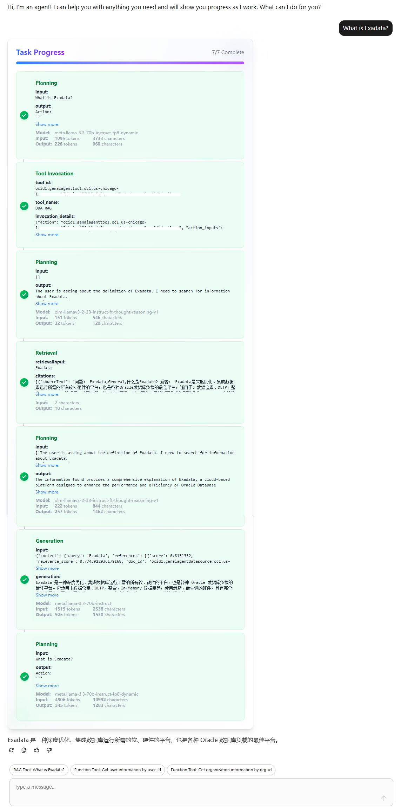
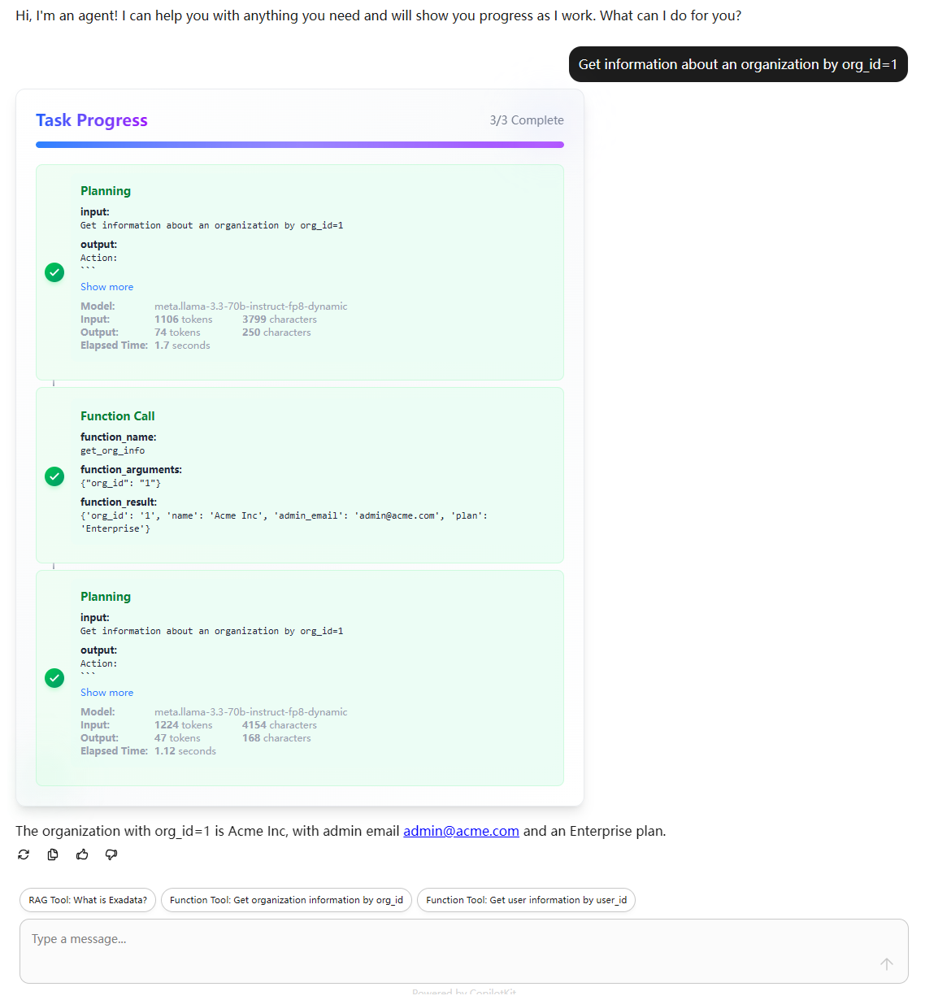
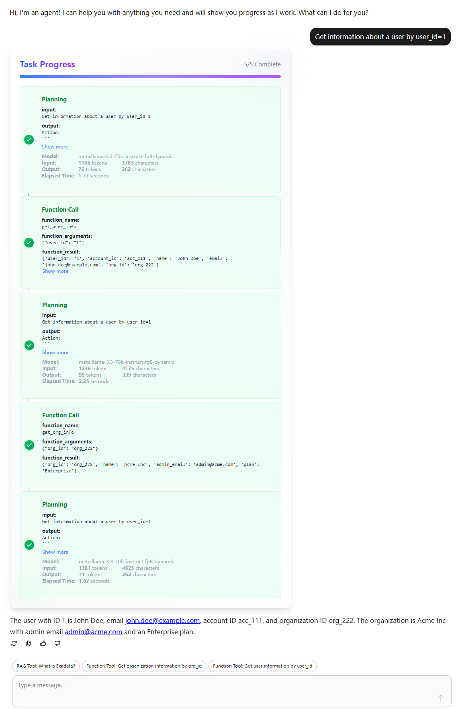

# OCI AI Agent UI

A modern web interface for interacting with OCI AI agents, built with Next.js and FastAPI.

Frameworks:
- OCI Agent Development Kit (ADK): setting up and modifying OCI AI Agent Service
- AG-UI: an open, lightweight, event-based protocol that standardizes how AI agents connect to user-facing applications.
- CopilotKit: an easy way to add AI copilots - intelligent, context-aware assistants - into your app.
- Next.js: a React framework for building server-rendered and static web applications.
- FastAPI: a modern, fast (high-performance), web framework for building APIs with  Python.


*Note: The main purpose of this project is to test OCI AI Agent through a neat web interface. Current version is only for testing and development purpose. It should be modified for production use.*

## 🚀 Quick Start

### Prerequisites
- Node.js 18+
- Python 3.9+

### Frontend Setup

1. Install dependencies:
   ```bash
   cd frontend
   npm install
   ```

2. Start the development server:
   ```bash
   npm run dev:ui
   ```
   The frontend will be available at `http://localhost:3000`

### Backend Setup

1. Set up environment variables:
   ```bash
   cp backend/src/.env.example backend/src/.env
   ```
   Update the environment variables in `backend/src/.env` with your own values.

2. Install dependencies using `uv` (no virtual environment needed):
   ```bash
   cd backend
   uv pip install -r requirements.txt
   ```

3. Start the backend server with hot reload:
   ```bash
   uv run src/main.py
   ```
   The API will be available at `http://localhost:8008`

## Screen Shots

<div align="center">
  <table>
    <tr>
      <td align="center">
        <strong>RAG Agent</strong><br/>
        
      </td>
      <td align="center">
        <strong>Single Function Tool Agent</strong><br/>
        
      </td>
      <td align="center">
        <strong>Multiple Function Tool Agent</strong><br/>
        
      </td>
    </tr>
  </table>
</div>


## Advanced Setup

### How it works

When you send a message to the agent, the backend will response with a stream of events, including agent's traces(planning, tool invocations, etc.) and answer message.

The frontend uses CopilotKit to interact with the backend.

The frontend and backend are connected through AG-UI protocol. The frontend sends a message to the backend, and the backend sends a response to the frontend. The response is a stream of events, which are processed by the frontend and displayed in the UI.

The backend uses OCI Python SDK to interact with OCI AI Agent Service, which is setting through OCI Agent Development Kit. 

Every time the front page refreshes, a new agent session is created in the backend. The session ID is passed to the backend through the AG-UI protocol.


### Setting up OCI AI Agent service

You can find the documentation for setting up OCI AI Agent service through [OCI Agent Development Kit](https://docs.oracle.com/en-us/iaas/Content/generative-ai-agents/adk/api-reference/introduction.htm).

An example is provided in the [backend/src/adk_rag&tool.py](backend/src/adk_rag&tool.py) file.

### Frontend-Backend Connection

By default, the frontend connects to the backend at `http://localhost:8008`. To change this:

1. Update the agent URL in `frontend/src/app/api/copilotkit/route.ts`:
   ```js
   const runtime = new CopilotRuntime({
     agents: {
       "my_agent": new HttpAgent({url: "YOUR_BACKEND_URL"}),
     }   
   });
   ```

2. Ensure the agent name matches in `frontend/src/app/page.tsx`:
   ```js
   <CopilotKit agent="my_agent">
     <Chat />
   </CopilotKit>
   ```

## 📦 Project Structure

```
.
├── frontend/         # Next.js frontend application
├── backend/          # FastAPI backend service
│   ├── src/          # Source code
└── README.md         # This file
```

## 📝 License

This project is licensed under the MIT License - see the [LICENSE](LICENSE) file for details.
